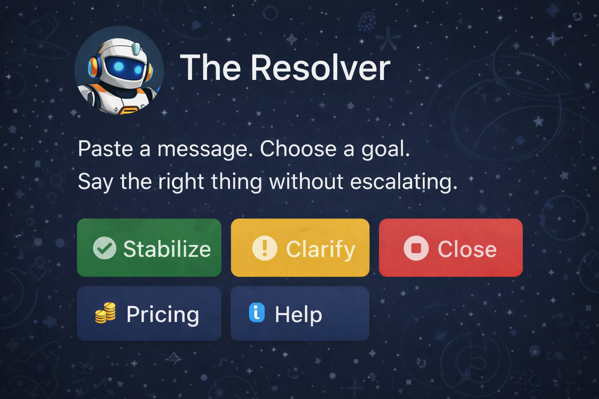

<p align="center">
  
</p>

# The Resolver Bot

A Telegram bot that helps you say the right thing without escalating conversations.

<p align="center">
  
</p>

## Features
- **Stabilize**: Calm, grounded responses to reduce tension
- **Clarify**: Firm, respectful responses that set clear boundaries
- **Close**: Direct, composed responses to end conversations cleanly
- **Free tier**: 1 Stabilize resolve per day
- **Paid tier**: All goals + paid resolves with one free retry after a paid resolve
- **Payments**: Telegram Stars invoices (XTR) with short invoice payloads stored in SQLite
- **V2 Personal (opt-in)**: Language + language mode per user
- **V2 Groups (opt-in)**: Admin-only group moderation with paid subscriptions

## Quick Start

### 1) Clone and install
```bash
git clone https://github.com/Justadudeinspace/resolver.git
cd resolver
chmod +x install_resolver.sh
./install_resolver.sh
```

### 2) Configure
```bash
cp .env.example .env
# Edit .env with your bot token from @BotFather
```

### 3) Run
```bash
./run_resolver.sh
```

## Termux Install (Android)
```bash
pkg install git
chmod +x install_resolver.sh
./install_resolver.sh
./run_resolver.sh
```

## Environment Variables
- `BOT_TOKEN` - Telegram bot token from @BotFather
- `USE_LLM` - `true` or `false` to enable OpenAI usage
- `OPENAI_API_KEY` - Optional (only if using LLM)
- `LLM_MODEL` - Model name (default: `gpt-4o-mini`)
- `LLM_TEMPERATURE` - Response creativity
- `RATE_LIMIT_PER_USER` - Requests per minute
- `MAX_INPUT_LENGTH` - Max characters in input
- `DB_PATH` - SQLite path (default: `./data/resolver.sqlite3`)
- `FEATURE_V2_PERSONAL` - Enable v2 personal settings (`true`/`false`, default `false`)
- `FEATURE_V2_GROUPS` - Enable v2 group moderation (`true`/`false`, default `false`)
- `LOG_LEVEL` - Logging level (INFO, DEBUG, etc.)

## Dependency Baseline
- Python 3.9+
- aiogram v3
- openai v1
- httpx v0.28+
- pydantic v2

## LLM Fallback & Lazy Initialization
- The OpenAI client is created lazily only when LLM usage is enabled and a request is made.
- If `USE_LLM=false`, `OPENAI_API_KEY` is missing, or the client fails to initialize, Resolver
  falls back to template responses and continues running.

## V2 Feature Flags (Disabled by Default)
V2 features are opt-in. If the flags are missing, they default to `false`.

- To enable V2 Personal:
  - Set `FEATURE_V2_PERSONAL=true`
  - Users must opt in via the `/settings` toggle before v2 personal options appear.
- To enable V2 Groups:
  - Set `FEATURE_V2_GROUPS=true`

## Telegram Stars Notes
- Stars invoices require enabling **Stars** monetization in @BotFather.
- The bot uses `currency="XTR"` and an empty `provider_token`.
- XTR amounts are specified in whole Stars (no minor-unit scaling).
- Buttons open Telegram Stars invoices, and resolves are added only after `successful_payment` validation.
- Group subscriptions use separate Stars plans and activate only after `successful_payment`.

## Stars Invoice Payloads
- The invoice payload is a short `invoice_id` (<= 128 bytes) stored in SQLite.
- Invoice context (user, plan, amount, currency, status, timestamps) is persisted before sending the invoice.
- Idempotency is enforced via `telegram_payment_charge_id` on successful payment handling.

## Core Flow
1) `/start` → choose a goal
2) Send your text
3) Receive 3 response options
4) Use **Retry** modifiers (Softer / Firmer / Shorter)

## Defaults (Settings)
- Use `/settings` to set a **default goal** and **default tone**.
- If a default goal is set, `/resolve` auto-selects it and prompts for text (tap another goal to switch).
- Default tone is applied to the first response set unless you choose a retry modifier.
- When `FEATURE_V2_PERSONAL=true`, `/settings` also lets you set:
  - **Language** (top 15 languages)
  - **Language mode**: Clean / Adult / Unrestricted

## Rules
- **Free tier**: 1 Stabilize resolve per day.
- **Retry rule**: One free retry after a paid resolve; additional retries consume paid resolves.
- **Stars plans**:
  - Starter: 5 ⭐ = 1 resolve
  - Bundle: 20 ⭐ = 5 resolves
  - Pro: 50 ⭐ = 15 resolves

## Group Subscriptions (V2 Groups)
Group moderation is admin-only and requires:
1) `FEATURE_V2_GROUPS=true`
2) Group enabled in `/groupadmin`
3) An active subscription

Plans:
- Monthly: 20 ⭐ → 30 days
- Yearly: 100 ⭐ → 365 days
- Lifetime: 1000 ⭐ → no expiry

## Moderation Ladder (V2 Groups)
When entitled, triggers follow:
1) De-escalation message
2) Violation counter increments
3) Warn at `warn_threshold`
4) Temporary mute at `mute_threshold` (10 minutes)

No auto-bans, no silent moderation, no admin overrides.

## Commands
**DM commands**
- `/start` - Begin. Choose a goal and resolve a message.
- `/resolve` - Resolve a message by choosing a goal and getting clear options.
- `/pricing` - View resolve pricing and Star bundles.
- `/buy` - Purchase resolve bundles with Stars.
- `/account` - View your remaining resolves and usage.
- `/settings` - Set your default goal, response style, and language (v2 personal).
- `/help` - Learn how to use The Resolver.
- `/feedback` - Send feedback to improve the bot.

**Group commands (admin-only)**
- `/groupadmin` - Group control panel and subscription status.
- `/grouplogs` - View the last 20 moderation actions.

## BotFather commands
```
/start
/resolve
/pricing
/buy
/account
/settings
/groupadmin
/grouplogs
/help
/feedback
```

## File Structure
```
.
├── app/
│   ├── __init__.py
│   ├── config.py
│   ├── db.py
│   ├── handlers.py
│   ├── languages.py
│   ├── llm.py
│   ├── main.py
│   ├── middlewares.py
│   ├── payments.py
│   ├── states.py
│   └── texts.py
├── .env.example
├── .gitignore
├── docs/
│   ├── assets/
│   ├── LAUNCH_CHECKLIST.md
│   ├── MVP_CHECKLIST.md
│   ├── admin_permissions.md
│   ├── launch_readiness_checklist.md
│   ├── resolver.md
│   └── v2_roadmap.md
├── install_resolver.sh
├── LICENSE
├── requirements.txt
├── run_resolver.sh
└── README.md
```

## Development
```bash
python -m app.main
python -m compileall app
```

## Changelog
- Added settings defaults for goal/style and applied them to `/resolve` with a Change goal option.
- Added a feedback submenu and database logging for feedback messages.

## License
[Proprietary](./LICENSE) - All rights reserved.
